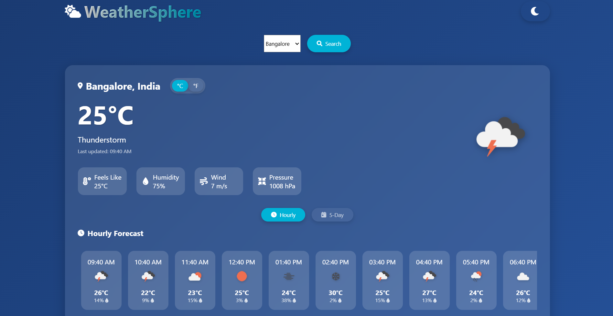

# WeatherSphere - Modern Weather App 🌦️

live:- https://tridev9.github.io/weather-/



WeatherSphere is a beautiful, responsive weather application that displays current conditions and forecasts for major Indian cities. Built with pure HTML, CSS, and JavaScript, it offers a sleek user interface with theme switching and unit conversion features.

## Features ✨

- **Current Weather Display**: Temperature, conditions, feels-like, humidity, wind, and pressure
- **5-Day Forecast**: Daily temperature ranges and conditions
- **24-Hour Forecast**: Hourly temperature and precipitation chance
- **City Selection**: Choose from top 5 Indian cities
- **Unit Conversion**: Switch between Celsius and Fahrenheit
- **Theme Switching**: Automatic day/night mode based on time
- **Responsive Design**: Works on all device sizes
- **No API Required**: Uses generated weather data

## Supported Cities 🏙️

- Mumbai
- Delhi
- Bangalore
- Hyderabad
- Chennai

## Technologies Used 💻

- **Frontend**: HTML5, CSS3, JavaScript
- **Icons**: Font Awesome
- **Weather Icons**: OpenWeatherMap icons (used for display purposes)

## Installation & Usage 🚀

No installation required! Simply:

1. Clone the repository or download the files
2. Open `index.html` in any modern browser
3. Select a city from the dropdown
4. Explore current weather and forecasts

## Customization 🎨

Want to add more cities? Edit the `cities` object in the JavaScript:

```javascript
const cities = {
    "Mumbai": { baseTemp: 30, baseHumidity: 75 },
    "Delhi": { baseTemp: 28, baseHumidity: 60 },
    // Add more cities here
};
```

##Future Enhancements 🔮

* Add more Indian cities
* Implement actual weather API integration option
* Add animated weather backgrounds
* Include air quality index
* Add weather alerts

##Contributing 🤝
Contributions are welcome! Please open an issue or submit a pull request.
